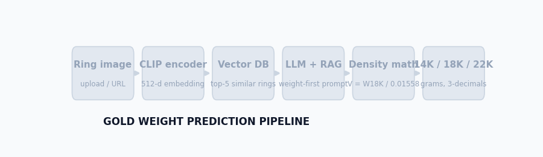
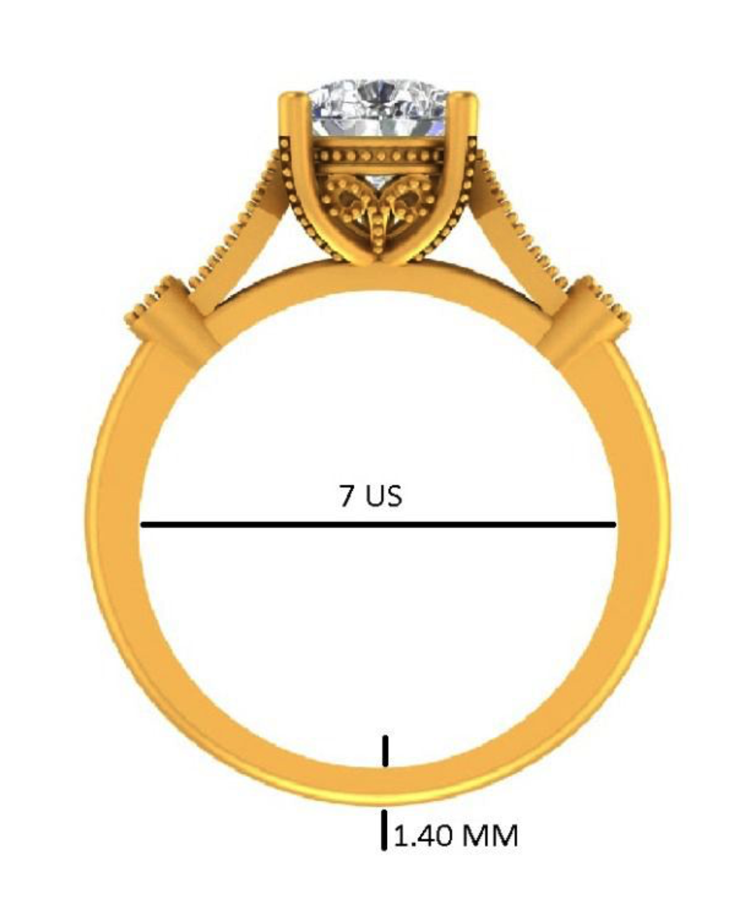
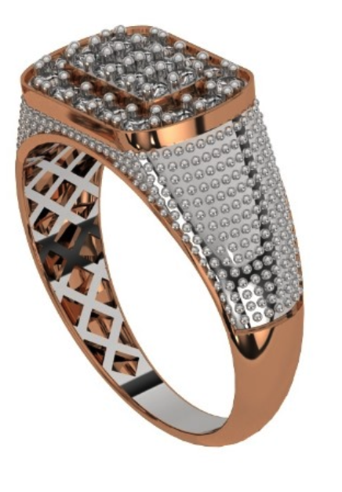
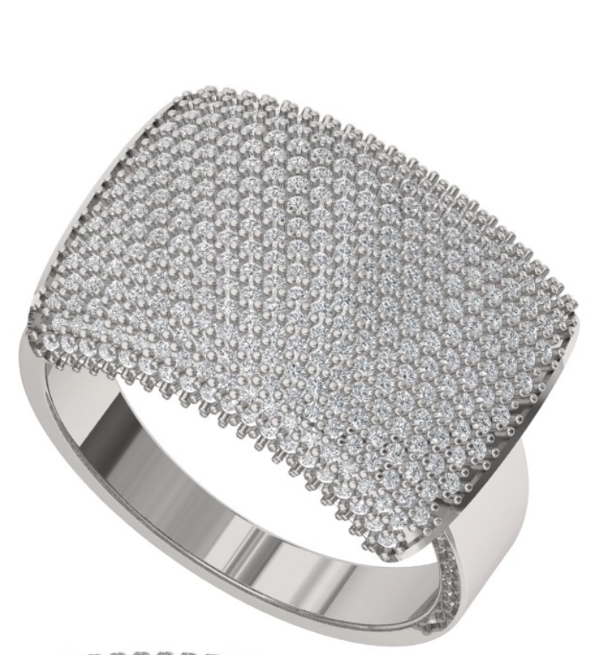
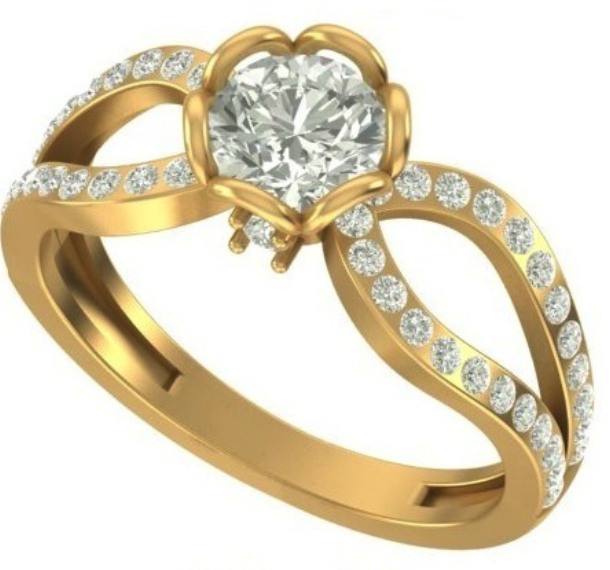
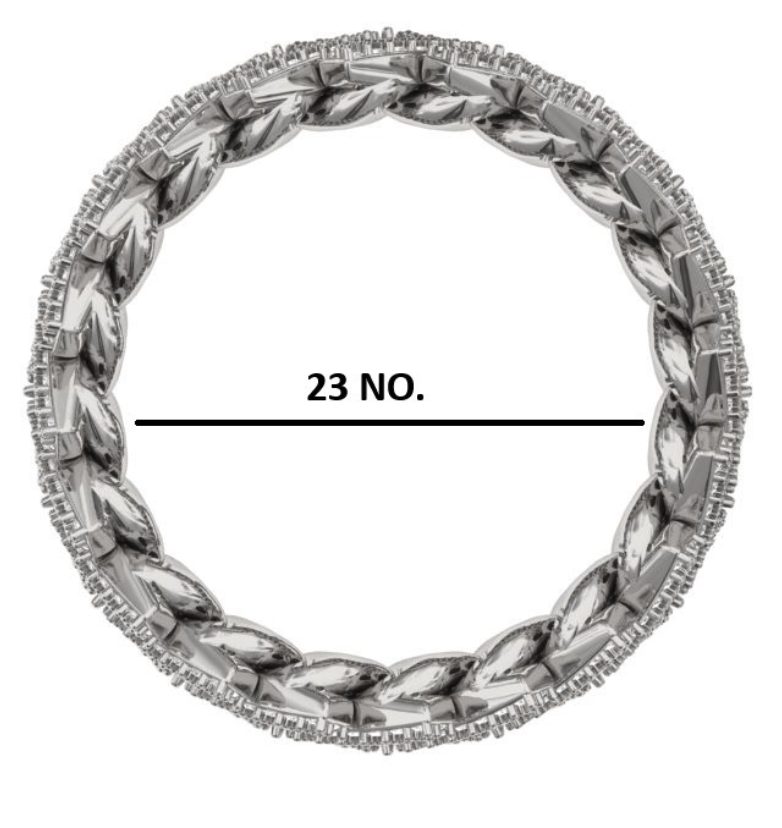
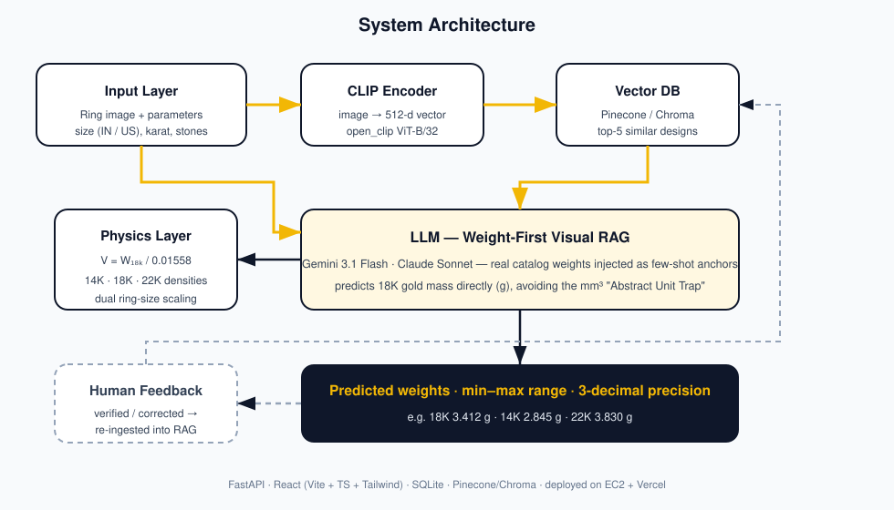
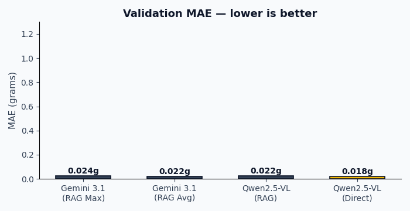

<div align="center">

# 💍 Gold Weight Prediction

**AI that looks at a ring and tells you exactly how many grams of gold it needs.**

[](https://fastapi.tiangolo.com/)
[](https://vite.dev/)
[](https://ai.google.dev/)
[](https://www.pinecone.io/)
[](https://gold-weight-frontend.vercel.app)
[](CHANGELOG.md)

[**Live App**](https://gold-weight-frontend.vercel.app) · [**API Docs**](http://13.207.220.204:8000/docs) · [**Project Guide**](docs/project_guide.md) · [**Changelog**](CHANGELOG.md)

</div>

---

## ✨ What it does

Give it a **ring photo** (upload or URL) plus a few manufacturing parameters — size, karat, stone count — and it returns the **gold weight in grams** for 14K / 18K / 22K with a min–max manufacturing range, in under a second.

It replaces the "senior jeweler eyeballs it" step that loses workshops ~5% of gold value every week.

| | |
|---|---|
| 📸 **Input** | Ring image (upload or CDN URL) + size (🇮🇳 India 1–30 / 🇺🇸 US), karat, band & stone specs |
| ⚖️ **Output** | `18K: 3.412 g` · `14K: 2.845 g` · `22K: 3.830 g` · volume · min–max range · reasoning |
| 🎯 **Precision** | 3-decimal grams, physics-checked against real gold densities |
| 🧠 **Learning** | Every jeweler-verified design is re-ingested into the visual RAG index |

<div align="center">

</div>

---

## 🖼️ It works on real designs

<p align="center">
  
  &nbsp; 
  &nbsp; 
  &nbsp; 
  &nbsp; 
</p>

<p align="center"><sub>Catalog renders, workshop CAD shots and CDN URLs — all accepted as input.</sub></p>

---

## 🧠 How the prediction actually works

The hard part of this problem is that LLMs are terrible at raw cubic millimetres — they overestimate volume badly (the **"Abstract Unit Trap"**). This system never asks the model for a volume. It uses a **weight-first** approach:

1. **Visual RAG anchoring** — the image is embedded with CLIP (512-d) and the 5 most similar past designs are pulled from Pinecone **with their real, casted gram weights**.
2. **Direct 18K prediction** — the LLM sees real rings at real weights and predicts the mass of the design in grams directly, not mm³.
3. **Density-cohesive conversion** — the backend recovers the implicit volume and derives every other karat from strict physical densities:

   ```
   V    = W₁₈ₖ / 0.01558            (mm³)
   14K  = V × 0.01307  g            (13.07 g/cm³)
   18K  = V × 0.01558  g            (15.58 g/cm³)
   22K  = V × 0.01750  g            (17.50 g/cm³)
   ```

4. **Dual-standard ring scaling** — 🇮🇳 Indian sizes (1–30 lookup chart) and 🇺🇸 US sizes (linear diameter formula) both supported; volume scales by target/base inner circumference ratio, which killed a systematic **+30% overestimation** bug.
5. **Human feedback loop** — a prediction only enters the training pool after a jeweler approves or corrects it. The system can never train on its own unverified output.

<div align="center">

</div>

---

## 📊 Evaluation

Fine-tuned **Qwen2.5-VL-3B** (LoRA, 3 epochs on an NVIDIA A10) vs **Gemini 3.1 Flash + RAG** on a 20-ring validation split:

<div align="center">

</div>

| Model config | MAE (g) | MAPE |
|---|---:|---:|
| **Qwen2.5-VL fine-tuned (direct)** | **0.797 g** | 44.23% |
| Gemini 3.1 Flash (RAG, avg) | 0.969 g | 46.32% |
| Qwen2.5-VL fine-tuned (RAG) | 1.005 g | 45.06% |
| Gemini 3.1 Flash (RAG, max) | 1.062 g | 51.42% |

Full report: [`scratch/model_comparison_report.md`](scratch/model_comparison_report.md) · [`docs/qwen_evaluation_report.pdf`](docs/qwen_evaluation_report.pdf)

---

## 🗂️ Dataset

| Source | Rings | Notes |
|---|---:|---|
| Tanishq | 504 | mostly 22KT, Indian sizes |
| Orra | 1,094 | 14K / 18K / Platinum, US sizes |
| **Unified** | **1,598** | one schema, 3,300+ multi-angle images, CLIP-ingested |

Unified schema lives in `Tanishq_Jewelry_Dataset_Final/`, embeddings are upserted to Pinecone index `ring-designs-v3` (512-dim).

---

## 🛠️ Tech stack

| Layer | Choice |
|---|---|
| API | FastAPI · Uvicorn · Pydantic · SQLAlchemy (async, SQLite) |
| Embeddings | OpenCLIP `ViT-B-32` (512-d) |
| Vector store | Pinecone (cloud) ↔ ChromaDB (local), one-line switch |
| LLM | Gemini 3.1 Flash (primary) · Claude 3.5 Sonnet (fallback), runtime-switchable from Admin |
| ML | XGBoost (tabular, Phase 3) · Qwen2.5-VL-3B LoRA (vision, A10 + MLX on Mac) |
| Frontend | React 18 · Vite · TypeScript · Tailwind 4 · Recharts |
| Deploy | Backend on AWS EC2 · Frontend on Vercel with `/api/v1/*` same-domain rewrites |

---

## 🚀 Quick start

**Backend**

```bash
cd backend_aws
python -m venv venv && source venv/bin/activate
pip install -r requirements.txt

# create .env with: GEMINI_API_KEY, ANTHROPIC_API_KEY (optional),
#                   PINECONE_API_KEY, PINECONE_INDEX_NAME=ring-designs-v3
uvicorn app.main:app --reload --port 8000
# → http://localhost:8000/docs
```

**Frontend**

```bash
cd frontend_aws
npm install
npm run dev
# → http://localhost:5173
```

`frontend_aws/src/config.ts` points at `/api/v1`; for local dev either run Vite's proxy or set `API_BASE_URL=http://localhost:8000/api/v1`.

---

## 📡 API

| Method | Endpoint | Purpose |
|---|---|---|
| `POST` | `/api/v1/predict` | Predict weights from images/URL + params |
| `POST` | `/api/v1/search` | CLIP similarity search over the catalog |
| `POST` | `/api/v1/ingest` | Ingest a jeweler-verified design into RAG |
| `GET` | `/api/v1/history` | Prediction history |
| `GET/POST` | `/api/v1/settings` | Admin: provider choice & API keys (keys never returned) |

```bash
curl -X POST http://localhost:8000/api/v1/predict \
  -F "images=@ring.png" \
  -F 'params={"karat":"18K","ring_size":12,"size_standard":"in","side_stone_count":24}'
```

```json
{
  "predicted_weight_18k": 3.412,
  "predicted_weight_14k": 2.845,
  "predicted_weight_22k": 3.830,
  "total_volume_mm3": 218.999,
  "range": {"min": 3.280, "max": 3.650},
  "confidence": "high"
}
```

---

## 📁 Project structure

```
Gold_weight_prediction/
├── backend_aws/          # FastAPI service deployed to EC2 (active)
│   └── app/
│       ├── api/          # predict · search · ingest · settings
│       ├── db/           # Pinecone / Chroma clients
│       └── core/         # config, CLIP encoder
├── backend/              # local CLIP backend variant
├── frontend_aws/         # React app (Predict · History · Admin tabs)
├── frontend/             # Vercel-deployed variant
├── Tanishq_Jewelry_Dataset_Final/   # unified 1,598-ring catalog
├── scripts/              # dataset → JSONL builders for tuning
├── scratch/              # training, evaluation & experiment scripts
├── docs/                 # guides, evaluation reports, README media
└── CHANGELOG.md
```

---

## 🗺️ Roadmap

- [x] Weight-first visual RAG prediction
- [x] Dual-standard 🇮🇳/🇺🇸 ring sizing
- [x] 14K / 18K / 22K density-cohesive conversion
- [x] Verified-design ingestion + Admin panel
- [x] Qwen2.5-VL LoRA fine-tuning (A10 / MLX)
- [ ] XGBoost tabular ensemble (Phase 3)
- [ ] Prediction CSV export & error dashboard

---

## 📚 Docs

| Doc | What's inside |
|---|---|
| [docs/project_guide.md](docs/project_guide.md) | Full problem statement, architecture & phase plan |
| [docs/deploy_guide.md](docs/deploy_guide.md) | EC2 + Vercel runbook, verification commands |
| [docs/aws_guide.md](docs/aws_guide.md) | AWS specifics |
| [docs/cad_file_research.md](docs/cad_file_research.md) | CAD/mesh weight-calculation research |
| [AI_CONTEXT.md](AI_CONTEXT.md) | Current system snapshot |
| [CHANGELOG.md](CHANGELOG.md) | Version history |

---

<div align="center">
<sub>Built by <a href="https://github.com/Priinc3">Priince Gondaliya</a> · Jewelry Manufacturing × AI/ML</sub>
</div>
